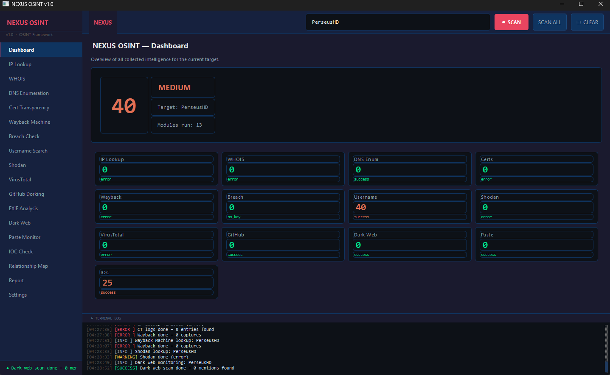

# NEXUS OSINT v1.0

**Autorisiertes OSINT-Framework für Penetrationstests und Bug-Bounty-Research.**

> ⚠️ Dieses Tool ist ausschließlich für autorisierte Sicherheitstests bestimmt.
> Nutzung nur mit ausdrücklicher schriftlicher Genehmigung des Zielunternehmens/-inhabers.

---




## Setup (Windows)

```
1. setup.bat doppelklicken  →  installiert alle Dependencies
2. python main.py           →  startet die App
```

### Oder manuell:
```bash
pip install -r requirements.txt
python main.py
```

---

## Module & benötigte API-Keys

| Modul              | Kostenlos | API-Key nötig | Bezugsquelle                              |
|--------------------|-----------|---------------|-------------------------------------------|
| IP Lookup          | ✅         | Nein          | ipapi.co                                  |
| WHOIS              | ✅         | Nein          | python-whois (lokal)                      |
| DNS Enumeration    | ✅         | Nein          | dnspython (lokal)                         |
| Cert Transparency  | ✅         | Nein          | crt.sh API                               |
| Wayback Machine    | ✅         | Nein          | archive.org API                           |
| Breach Check       | ✅ (Free)  | **Ja**        | haveibeenpwned.com/API/Key               |
| Username Search    | ✅         | Nein          | Direktanfragen an 30+ Plattformen         |
| Shodan             | ✅ (Free)  | **Ja**        | account.shodan.io                         |
| VirusTotal         | ✅ (Free)  | **Ja**        | virustotal.com/gui/my-apikey             |
| GitHub Dorking     | ✅ (Free)  | **Ja**        | github.com/settings/tokens               |
| EXIF Analysis      | ✅         | Nein          | lokal (exifread, Pillow)                  |
| Dark Web           | ✅         | Nein          | Tor + Ahmia.fi (Tor muss laufen)          |
| Paste Monitor      | ✅         | Nein          | psbdmp.ws API                             |
| IOC Check          | ✅         | Nein          | abuse.ch (URLhaus, ThreatFox, MalwareBazaar)|
| Relationship Map   | ✅         | Nein          | networkx + matplotlib (lokal)             |
| Report Generator   | ✅         | Nein          | reportlab (lokal)                         |

---

## Dark Web Modul

Erfordert Tor Browser oder Tor Service:

```
# Tor installieren und starten:
# Windows: https://www.torproject.org/download/
# Läuft standardmäßig auf 127.0.0.1:9050
```

Host/Port sind in den Settings konfigurierbar.

---

## Build → .exe

```
build.bat doppelklicken
→ dist/NEXUS_OSINT.exe
```

---

## Projektstruktur

```
NEXUS_OSINT/
├── main.py               # Entry point
├── requirements.txt
├── setup.bat / build.bat
├── config.json           # API-Keys (auto-erzeugt)
├── config/settings.py    # Key-Management
├── modules/              # 15 Scan-Module
└── ui/
    ├── main_window.py
    ├── styles.py
    └── panels/           # 18 UI-Panels
```

---

*NEXUS OSINT – Nur für autorisierte Sicherheitsforschung.*
